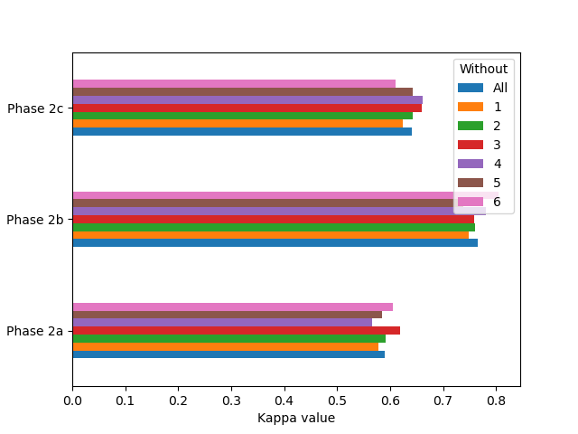
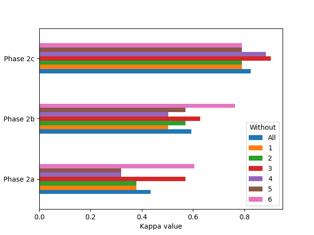
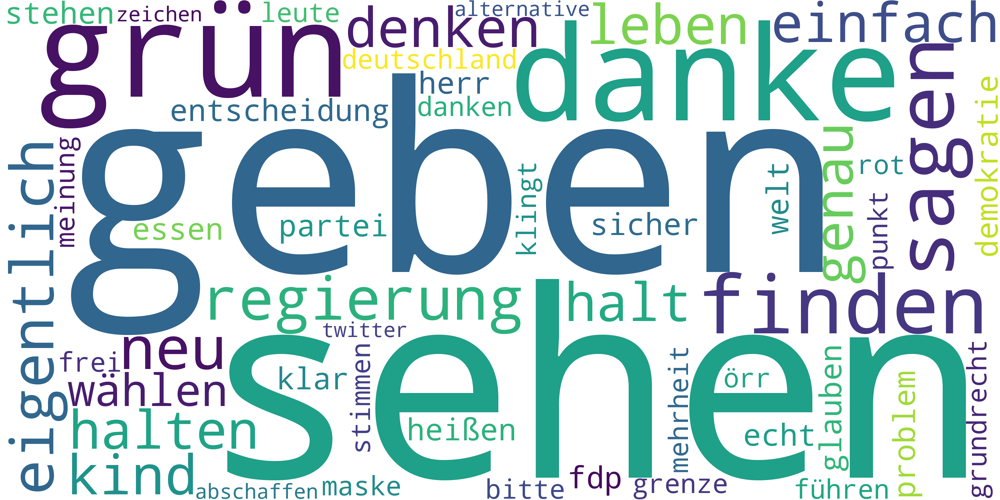
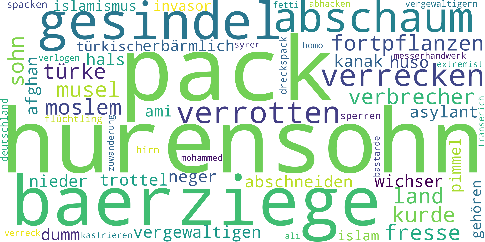
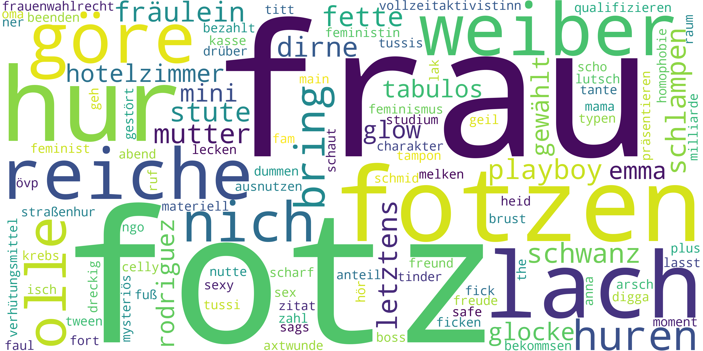

# Corpus of German misogynistic hatespeech posts (GMHP7k)
## A German Corpus on misogynistic hatespeech posts from Twitter
On this page we provide the data set for the corpus on German misogynistic hatespeech posts (GMHP7k), which was first presented on the [18th International AAAI Conference on Web and Social Media](https://www.icwsm.org/2024/) (ICWSM 2024) along with a dataset paper.
<!-- Details can be found in the section [Citation](#citation) below. -->

## Description
We provide a German corpus consisting of 7,061 posts authored by users of social media platforms. A group of volunteers annotated each post according to hatespeech and misogynistic/misogynous hatespeech in a binary fashion. The inter-rater reliability over all annotators according to Fleiss’ Kappa is 0.6409 for hatespeech and 0.8258 for misogynistic hatespeech. Furthermore, baseline measurements with machine learning based text classification with BERT are presented. Initial experiments with the corpus achieve macro average F1-scores up to 0.79 for hatespeech and 0.75 for misogynistic hatespeech.

### Classes to annotate
During annotation, volunteers rated two aspects of a post: the presence of *hatespeech* and *misogynistic hatespeech*. The availability of hatespeech depends on perception of the comment text by the annotators and can be rated as *hatespeech* or *not hatespeech*. The misogynistic hatespeech, on the other hand, can be either *misogynistic hatespeech* or *not misogynistic hatespeech*.

### Data Description

<table>
<colgroup>
<col style="width: 18%" />
<col style="width: 36%" />
<col style="width: 44%" />
</colgroup>
<thead>
<tr class="header">
<th style="text-align: left;">Column</th>
<th style="text-align: left;">Name</th>
<th>Description</th>
</tr>
</thead>
<tbody>
<tr class="odd">
<td style="text-align: left;">tweet_id</td>
<td style="text-align: left;">Tweet ID</td>
<td>Source ID from Twitter</td>
</tr>
<tr class="even">
<td style="text-align: left;">review_text</td>
<td style="text-align: left;">Text of the tweet or comment</td>
<td>User mentions were replaced by <span class="citation"
data-cites="TwitterUser">@TwitterUser</span></td>
</tr>
<tr class="odd">
<td style="text-align: left;">hs</td>
<td style="text-align: left;">Hatespeech annotation</td>
<td>Binary (1 or 0)</td>
</tr>
<tr class="even">
<td style="text-align: left;">m_hs</td>
<td style="text-align: left;">Misogynistic hatespeech annotation</td>
<td>Binary (1 or 0)</td>
</tr>
<tr class="even">
<td style="text-align: left;">annotation_id</td>
<td style="text-align: left;">ID of annotation</td>
<td>Tweets of phase 2 were annotated by all experts</td>
</tr>
<tr class="odd">
<td style="text-align: left;">created_at</td>
<td style="text-align: left;">Created timestamp of annotation</td>
<td></td>
</tr>
<tr class="even">
<td style="text-align: left;">updated_at</td>
<td style="text-align: left;">Updated timestamp of annotation</td>
<td></td>
</tr>
<tr class="odd">
<td style="text-align: left;">lead_time</td>
<td style="text-align: left;">Elapsed time of annotation</td>
<td></td>
</tr>
<tr class="even">
<td style="text-align: left;">phase</td>
<td style="text-align: left;">Phase</td>
<td>1, 2.1, 2.2, 2.3 or 3</td>
</tr>
<tr class="odd">
<td style="text-align: left;">annotator_name</td>
<td style="text-align: left;">Annotator name</td>
<td>Pseudonym Identity of the annotators as consecutive numbers</td>
</tr>
<tr class="even">
<td style="text-align: left;">source</td>
<td style="text-align: left;">Source of text</td>
<td>Souce dataset of the text</td>
</tr>
<tr class="odd">
<td style="text-align: left;">split_hs</td>
<td style="text-align: left;">Source of text</td>
<td>“train”, “test”, or “val”</td>
</tr>
<tr class="even">
<td style="text-align: left;">split_m_hs</td>
<td style="text-align: left;">Source of text</td>
<td>“train”, “test”, or “val”</td>
</tr>
</tbody>
</table>

## Statistics
In order to achieve a high quality of annotation, two preliminary training phases were carried out, whereby the volunteers evaluated 46, 43 and 46 posts in each phase. After each phase, an inter-rater reliability was conducted with [Fleiss' Kappa](https://en.wikipedia.org/wiki/Fleiss%27_kappa) to measure the quality of the annotation. The resulting kappa values are shown in figure 1. The values for *hatespeech* are shown on the left, those of the *misogynistic hatespeech* on the right. In order to determine the impact of each volunteer on the kappa value, further kappa values were calculated for all combinations of n-1 volunteers.

<div>
<figure>

<figcaption align="center">Fig.1 - Interrater-reliability (LTR hatespeech and misogynistic hatespeech)</figcaption>
</figure>
</div>

<div>
<figure>

<figcaption align="center">Fig.2 - Wordclounds (LTR neutral, hatespeech and misogynistic hatespeech)</figcaption>
</figure>
</div>

After completion of the training phases, a further 7,061 posts were annotated, which form the core of the corpus. Their quality can be considered assured due to the solid inter-rater reliability of the training phases. Table 1 shows the quota of the 7,061 posts assigned to each class. The distribution
of hatespeech reveals that 22.29 % of the post were annotated as hatespeech. The table also shows the distribution of the second criterion misogynistic hatespeech, with 6.51 % of all posts are being rated as misogynisitc hatespeech. Consequently, 29.22 % of hatespeech posts are also misogynistic.

<figure>
<figcaption>Tab.1 - Number of posts per class in 7,061 posts</figcaption>
<table style="margin: 0px auto;">
  <thead>
    <tr>
      <th></th>
      <th align="right">Posts</th>
      <th align="right">Percent</th>
    </tr>
  </thead>
  <tbody>
    <tr>
      <td align="left">Hot hatespeech</td>
      <td align="right">5,487</td>
      <td align="right">77.71 %</td>
    </tr>
    <tr>
      <td align="left">Hatespeech</td>
      <td align="right">1,574</td>
      <td align="right">22.29 %</td>
    </tr>
    <tr>
      <td align="left">Not misogynistic hatespeech</td>
      <td align="right">6,601</td>
      <td align="right">93.49 %</td>
    </tr>
    <tr>
      <td align="left">Misogynistic hatespeech</td>
      <td align="right">460</td>
      <td align="right">6.51 %</td>
    </tr>
  </tbody>
</table>
</figure>

## License
The corpus is provided under the terms of the [Creative Commons Attribution 4.0 International (CC BY 4.0) License](https://creativecommons.org/licenses/by/4.0/). By using the corpus you agree to this license.


<!--
## Citation
The corpus was first presented at [ICWSM 2024](https://www.icwsm.org/2024/).
> *Jonas Glasebach, Max-Emanuel Keller, Alexander Döschl, Peter Mandl<br>
> **GMHP7k: A corpus of German misogynistic hatespeech posts**<br>
> Proceedings of the Eighteenth International AAAI Conference on Web and Social Media<br>
> Buffalo, NY, USA, June 6–9, 2024<br>*

If you are using the corpus, please cite the following publication. You can find a copy of the [paper here](https://www.icwsm.org/2024/). Reference in BibTeX format:
 ```
@inproceedings{Glasebach.2024,
 author = {Glasebach, Jonas and Keller, Max-Emanuel and Döschl, Alexander and Mandl, Peter},
 title = {GMHP7k: A corpus of German misogynistic hatespeech posts},
 booktitle = {Proceedings of the 25th Conference of Open Innovations Association FRUCT},
 series = {ICWSM 2024},
 year = {2024},
 location = {Buffalo, NY, USA},
}
 ```
-->

## How to use the data set?
The [repository to this page](https://github.com/ccwi/corpus-gmhp7k) provides the data set to the corpus along with the statistics and instructions for use.

## About
The presented corpus was developed during a project of the <a href="https://www.wirtschaftsinformatik-muenchen.de/">Competence Center Wirtschaftsinformatik (CCWI)</a> at the Munich University of Applied Sciences.

<a href="https://www.wirtschaftsinformatik-muenchen.de/"></a>

## Acknowledgement
Our special thanks goes to the experts who contributed to the annotation of the corpus. The presented work was conducted as part of a project funded by *Forschungs- und Entwicklungsprogramm Informations- und Kommunikationstechnik des Freistaates Bayern*. Funding reference number: DIK-2104-0033// DIK0278/01, DIK0278/02,
DIK0278/03.

The methodology of this work was inspired by the great work of [Schabus et. al.](http://dx.doi.org/10.1145/3077136.3080711) wo created the [One Million Posts Corpus](https://ofai.github.io/million-post-corpus/) together with the Austrian newspaper *Der Standard* from user comments under online articles on the site of the newspaper.

<!--
## How to run the experiments?
-->
